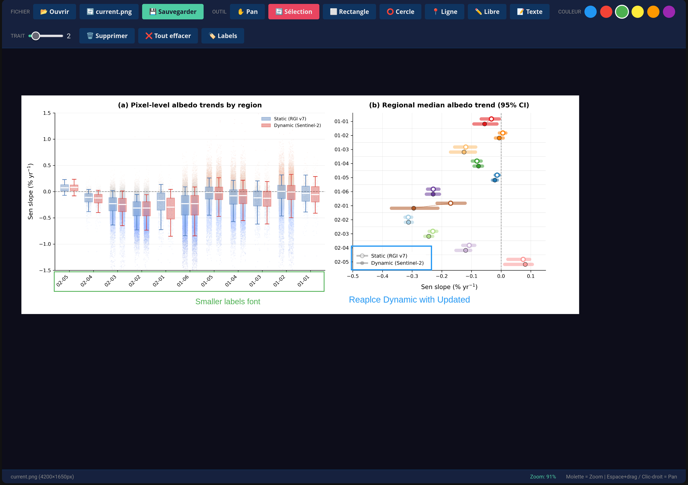

# Plot Annotator

A visual annotation tool for matplotlib plots, designed to work with **Claude Code** and **Codex CLI**. Draw shapes, add text instructions, and let AI modify your code automatically.

> **Use case:** Annotate a plot visually → AI reads annotations → AI modifies your matplotlib code → Confirm before applying



## Features

- **Pan & Zoom** - Navigate large plots like Google Maps
  - Mouse wheel to zoom in/out
  - Space + drag or Right-click + drag to pan
- **Drawing Tools** - Rectangle, Circle, Line, Freehand, Text
- **Color-coded Zones** - 6 colors to categorize annotations
- **Group System** - Group shapes + text for multi-part modifications
- **Refresh from Source** - Reload the original file after regenerating your plot
- **Labels Panel** - Add descriptions per color zone
- **Auto-save** - Annotations saved directly to disk (JSON + annotated PNG)
- **No dependencies** - Pure HTML/JS frontend (Fabric.js via CDN)
- **Cross-platform** - Works on Linux, macOS, Windows

## Quick Start

```bash
# Clone the repo
git clone https://github.com/tofunori/plot-annotator.git
cd plot-annotator

# Start the server
python3 annotate_server.py

# Open in browser
# http://localhost:8888/annotate.html
```

Then drag & drop your plot image onto the canvas.

## Controls

| Action | Control |
|--------|---------|
| **Zoom** | Mouse wheel |
| **Pan** | Space + drag, Right-click + drag, or Pan button |
| **Draw** | Select tool → click & drag |
| **Add Text** | Text tool → click → type in modal |
| **New Group** | ➕ button (groups shapes + text together) |
| **Refresh** | 🔃 button (reload from source after regenerating) |
| **Labels** | 🏷️ button → side panel |
| **Save** | 💾 button (auto-saves to disk) |
| **Delete** | Select object → Delete key |

## Refresh Workflow

The refresh button 🔃 allows you to reload your plot after modifying the source script:

1. **Open** your plot image
2. **Annotate** with shapes and text
3. **Modify** your Python script and regenerate the plot
4. **Click 🔃** to reload the updated image (annotations preserved)

The server automatically finds the file by name in common directories (`~/Github`, `/media/*/Data`, etc.).

## Output Files

When you save, files are created in `~/.claude/plots/`:

| File | Description |
|------|-------------|
| `current.png` | Current plot image |
| `current_annotated.png` | Image with annotations drawn |
| `current_annotations.json` | Annotation coordinates and metadata |
| `current_meta.json` | Source file path and script info |

### JSON Format

```json
{
  "zones": [
    {
      "id": "blue",
      "color": "#2196F3",
      "type": "rect",
      "group_id": 1,
      "bbox": [100, 50, 300, 150],
      "label": null
    },
    {
      "id": "blue",
      "color": "#2196F3",
      "type": "text",
      "group_id": 1,
      "text": "Change title to French",
      "position": [120, 80],
      "label": null
    }
  ],
  "created": "2026-01-22T10:00:00.000Z",
  "plot_name": "current"
}
```

**Group interpretation:** Shapes and text with the same `group_id` form a single modification request.

## Use Cases

### 1. AI-Assisted Plot Modification (Primary)
The main use case with Claude Code or Codex CLI:
1. Load your matplotlib figure
2. Annotate visually: draw shape + write instruction
3. AI analyzes annotations and proposes code changes
4. You confirm → code is modified → plot regenerated

### 2. Iterative Plot Refinement
Use the **refresh button 🔃** to iterate quickly:
1. Annotate changes needed
2. AI modifies code and regenerates
3. Click 🔃 to see the new plot (annotations preserved)
4. Add more annotations if needed
5. Repeat until perfect

### 3. Collaborative Review
Share annotated plots with colleagues or AI assistants for feedback.

## Installation Options

### Option A: Standalone (recommended)
```bash
python3 annotate_server.py
```
Serves files from `~/.claude/plots/` on port 8888.

### Option B: Custom directory
```bash
# Edit PLOTS_DIR in annotate_server.py
PLOTS_DIR = Path("/your/custom/path")
```

### Option C: Static file (no server)
Open `annotate.html` directly in browser. Note: auto-save and refresh won't work without the server.

## Server Endpoints

| Endpoint | Method | Description |
|----------|--------|-------------|
| `/save` | POST | Save annotations JSON |
| `/save-image` | POST | Save annotated PNG |
| `/refresh-from-source` | POST | Reload from original file path |
| `/refresh-by-filename` | POST | Search and reload by filename |
| `/set-source-path` | POST | Manually set source path |
| `/search-script` | POST | Find Python script that generates the plot |

## Available Colors

| Color | Hex | Use for |
|-------|-----|---------|
| Blue | #2196F3 | Primary annotations |
| Red | #F44336 | Issues, deletions |
| Green | #4CAF50 | Approved, correct |
| Yellow | #FFEB3B | Warnings, attention |
| Orange | #FF9800 | Secondary changes |
| Purple | #9C27B0 | Special notes |

## Requirements

- Python 3.6+ (for server)
- Modern browser (Chrome, Firefox, Safari, Edge)
- No pip dependencies!

## Integration with Claude Code & Codex CLI

This tool is designed to work with:
- **[Claude Code](https://github.com/anthropics/claude-code)** - Anthropic's CLI for Claude
- **[Codex CLI](https://github.com/openai/codex)** - OpenAI's coding assistant

Copy the `skills/` folder to your skills directory:
```bash
# For Claude Code
cp -r skills/plot ~/.claude/skills/

# For Codex CLI
cp -r skills/plot ~/.codex/skills/
```

### Workflow

```bash
# Load a plot
/plot load /path/to/figure.png

# Annotate in browser:
# - Draw rectangle around element to modify
# - Add text with instruction (same group)
# - Click 💾 Save

# Apply changes
/plot apply
# → AI shows proposed modifications with exact code changes
# → You confirm (oui/non) before any code is modified
# → Plot is regenerated automatically
```

### Why visual annotation?

Instead of describing changes in text ("make the x-axis labels smaller"), you:
1. **Draw** a rectangle around the x-axis labels
2. **Write** "smaller font" as text annotation
3. AI **sees** exactly what you're pointing at
4. AI **proposes** the exact code change
5. You **confirm** before anything is modified

## Browser Compatibility

| Browser | File Picker Refresh | Drag & Drop Refresh |
|---------|--------------------|--------------------|
| Chrome/Edge | ✅ Native | ✅ Native |
| Firefox/Zen | ✅ Auto-search | ✅ Auto-search |

Firefox users: The server automatically searches for files by name since Firefox doesn't support the File System Access API.

## License

MIT License - Feel free to use, modify, and distribute.

## Contributing

PRs welcome! Ideas for improvements:
- [ ] Undo/redo support
- [ ] Arrow tool
- [ ] Export to SVG
- [ ] Multiple pages/plots
- [ ] Annotation templates

## Credits

Built with [Fabric.js](http://fabricjs.com/) for canvas manipulation.
